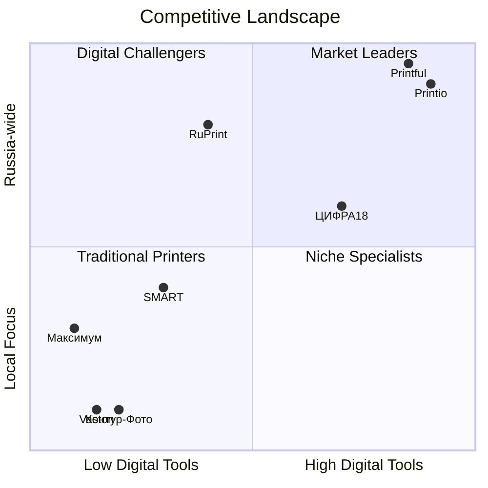

# Graph Visualization Configuration for ЦИФРА18 Knowledge Graph

## Neo4j Configuration

### Docker Compose for Neo4j
```yaml
version: '3.8'
services:
  neo4j:
    image: neo4j:5.15
    container_name: cifra18-neo4j
    ports:
      - "7474:7474"  # Browser
      - "7687:7687"  # Bolt
    volumes:
      - neo4j-data:/data
      - neo4j-logs:/logs
      - neo4j-import:/var/lib/neo4j/import
      - ./neo4j_init.cypher:/var/lib/neo4j/import/init.cypher
    environment:
      - NEO4J_AUTH=neo4j/cifra18kg2026
      - NEO4J_dbms_memory_heap_initial__size=1G
      - NEO4J_dbms_memory_heap_max__size=2G
      - NEO4J_dbms_memory_pagecache_size=1G
      - NEO4J_apoc_export_file_enabled=true
      - NEO4J_apoc_import_file_enabled=true
      - NEO4J_apoc_import_file_use__neo4j__config=true
      - NEO4JLABS_PLUGINS=["apoc", "graph-data-science"]
    restart: unless-stopped

volumes:
  neo4j-data:
  neo4j-logs:
  neo4j-import:
```

### Cypher Import Script (neo4j_init.cypher)
```cypher
// Create constraints and indexes
CREATE CONSTRAINT entity_id IF NOT EXISTS FOR (e:Entity) REQUIRE e.id IS UNIQUE;
CREATE INDEX entity_label IF NOT EXISTS FOR (e:Entity) ON (e.label);
CREATE INDEX entity_type IF NOT EXISTS FOR (e:Entity) ON (e.type);

// Import from TTL - using APOC
// First, load the TTL file
CALL apoc.import.rdf("file:///var/lib/neo4j/import/cifra18_knowledge_graph.ttl", 
  {format: "turtle", header: false, types: "owl:Class,rdfs:Class,cifra:*"})
YIELD node, nodeLabels, nodeProperties, relationship, relType, relProperties
RETURN count(*) as imported;

// Create additional indexes for common queries
CREATE INDEX service_category IF NOT EXISTS FOR (s:Service) ON (s.category);
CREATE INDEX material_type IF NOT EXISTS FOR (m:Material) ON (m.materialType);
CREATE INDEX location_city IF NOT EXISTS FOR (l:Location) ON (l.label);
CREATE INDEX industry_name IF NOT EXISTS FOR (i:Industry) ON (i.label);
CREATE INDEX competitor_name IF NOT EXISTS FOR (c:Competitor) ON (c.label);

// Create relationship indexes
CREATE INDEX has_service IF NOT EXISTS FOR ()-[r:HAS_SERVICE]-() ON (r.category);
CREATE INDEX produces IF NOT EXISTS FOR ()-[r:PRODUCES]-() ON (r.category);
CREATE INDEX competes_with IF NOT EXISTS FOR ()-[r:COMPETES_WITH]-() ON (r.threatLevel);
```

### Cypher Queries for Visualization

#### 1. Company Service Ecosystem
```cypher
MATCH (c:Entity {id: "cifra:company/cifra18"})-[r:HAS_SERVICE]->(s:Entity)
WHERE s.type IN ["PrintService", "WideFormatService", "DigitalPrintService", 
                 "OffsetPrintService", "MerchService", "EngineeringPrintService",
                 "PostPressService", "MobileStandService"]
OPTIONAL MATCH (s)-[:HAS_PRINT_METHOD]->(pm:Entity)
OPTIONAL MATCH (s)-[:HAS_MATERIAL]->(m:Entity)
RETURN c, r, s, pm, m
LIMIT 200;
```

#### 2. Material-Service Compatibility Matrix
```cypher
MATCH (s:Entity)-[:HAS_MATERIAL]->(m:Entity)
WHERE s.type IN ["PrintService", "WideFormatService", "MerchService", "MobileStandService"]
RETURN s.label as Service, collect(m.label) as Materials
ORDER BY Service;
```

#### 3. Competitor Landscape
```cypher
MATCH (c:Entity {id: "cifra:company/cifra18"})-[r:COMPETES_WITH]->(comp:Entity)
OPTIONAL MATCH (comp)-[:HAS_SERVICE]->(svc:Entity)
RETURN c, r, comp, collect(svc.label) as services
ORDER BY comp.threatLevel DESC;
```

#### 4. Target Cities with Delivery
```cypher
MATCH (c:Entity {id: "cifra:company/cifra18"})-[r:DELIVERS_VIA]->(d:Entity)
MATCH (d)-[:COVERS]->(loc:Entity)
WHERE loc.isTargetCity = true
RETURN loc.label as City, loc.population as Population, 
       loc.deliveryDaysFromIzhevsk as DeliveryDays,
       loc.hasSdekPVZ as HasPVZ
ORDER BY DeliveryDays;
```

#### 5. Industry Service Mapping
```cypher
MATCH (i:Entity)-[:SUITABLE_FOR]->(s:Entity)
WHERE i.type = "Industry" AND s.type IN ["Service", "PrintService", "MerchService"]
RETURN i.label as Industry, collect(s.label) as Services, i.avgCheck as AvgCheck
ORDER BY Industry;
```

#### 6. Equipment Capabilities
```cypher
MATCH (c:Entity {id: "cifra:company/cifra18"})-[r:HAS_EQUIPMENT]->(e:Entity)
OPTIONAL MATCH (e)-[:HAS_PRINT_METHOD]->(pm:Entity)
OPTIONAL MATCH (e)-[:HAS_MATERIAL]->(m:Entity)
RETURN e.label as Equipment, e.type as Type, e.maxFormat as MaxFormat,
       e.maxSpeed as MaxSpeed, collect(pm.label) as PrintMethods,
       collect(m.label) as Materials
ORDER BY Type;
```

#### 7. Intent Classification Tree
```cypher
MATCH (i:Entity)
WHERE i.type = "Intent"
RETURN i.label as Intent, i.comment as Description;
```

#### 8. Full Knowledge Graph Overview (for exploration)
```cypher
MATCH (n:Entity)-[r]->(m:Entity)
WHERE n.id STARTS WITH "cifra:"
RETURN n, r, m
LIMIT 500;
```

## Gephi Configuration

### Export for Gephi (GraphML)
```cypher
// Export to GraphML for Gephi
CALL apoc.export.graphml.all("file:///var/lib/neo4j/import/cifra18_graph.graphml", 
  {useTypes: true, storeNodeIds: true})
YIELD file, nodes, relationships, properties, time
RETURN file, nodes, relationships, time;
```

### Gephi Visual Settings
- **Layout**: ForceAtlas2 (for network exploration)
- **Node Size**: Degree centrality (services = larger)
- **Node Color**: By type (Service=blue, Material=green, Location=orange, Competitor=red, Industry=purple, Equipment=brown)
- **Edge Color**: By relationship type (HAS_SERVICE=blue, HAS_MATERIAL=green, COMPETES_WITH=red, LOCATED_IN=orange)
- **Labels**: Show for nodes with degree > 5

## Graphistry Configuration (GPU-accelerated)

### Python Export Script
```python
import pandas as pd
from rdflib import Graph

# Load KG
g = Graph()
g.parse("cifra18_knowledge_graph.ttl", format="turtle")

# Extract nodes
nodes = []
edges = []

CIFRA = Namespace("https://cifra18.ru/ontology#")
RDFS = Namespace("http://www.w3.org/2000/01/rdf-schema#")
RDF = Namespace("http://www.w3.org/1999/02/22-rdf-syntax-ns#")

for subj, pred, obj in g:
    if isinstance(subj, URIRef) and str(subj).startswith("https://cifra18.ru/ontology#"):
        # Get label
        label = g.value(subj, RDFS.label, None)
        if label:
            nodes.append({
                "id": str(subj),
                "label": str(label),
                "type": str(g.value(subj, RDF.type, None)).split("#")[-1] if g.value(subj, RDF.type, None) else "Unknown"
            })
    
    # Extract edges
    if pred in [CIFRA.hasService, CIFRA.produces, CIFRA.locatedIn, 
                CIFRA.deliversVia, CIFRA.hasEquipment, CIFRA.hasMaterial,
                CIFRA.hasPrintMethod, CIFRA.hasFinishing, CIFRA.competesWith]:
        edges.append({
            "source": str(subj),
            "target": str(obj),
            "relationship": str(pred).split("#")[-1]
        })

# Save for Graphistry
pd.DataFrame(nodes).drop_duplicates(subset=["id"]).to_csv("cifra18_nodes.csv", index=False)
pd.DataFrame(edges).to_csv("cifra18_edges.csv", index=False)
```

## Cytoscape.js Web Visualization

### HTML Template
```html
<!DOCTYPE html>
<html>
<head>
    <title>ЦИФРА18 Knowledge Graph</title>
    <script src="https://unpkg.com/cytoscape@3.28.1/dist/cytoscape.min.js"></script>
    <script src="https://unpkg.com/cytoscape-fcose@2.2.0/cytoscape-fcose.js"></script>
    <style>
        #cy { width: 100%; height: 100vh; }
        .info-panel { position: absolute; top: 20px; right: 20px; background: white; padding: 20px; border-radius: 8px; box-shadow: 0 2px 10px rgba(0,0,0,0.1); max-width: 300px; z-index: 1000; }
    </style>
</head>
<body>
    <div id="cy"></div>
    <div class="info-panel" id="info">
        <h3>Click a node for details</h3>
        <div id="details"></div>
    </div>
    <script>
        // Load data and initialize Cytoscape
        fetch('cifra18_elements.json').then(r => r.json()).then(data => {
            const cy = cytoscape({
                container: document.getElementById('cy'),
                elements: data,
                style: [
                    { selector: 'node', style: { 'label': 'data(label)', 'font-size': '10px', 'text-valign': 'bottom', 'text-halign': 'center', 'background-color': 'data(color)', 'width': 'mapData(degree, 0, 50, 20, 80)', 'height': 'mapData(degree, 0, 50, 20, 80)' } },
                    { selector: 'edge', style: { 'width': 1, 'line-color': 'data(color)', 'target-arrow-shape': 'triangle', 'target-arrow-color': 'data(color)', 'curve-style': 'bezier' } },
                    { selector: '.selected', style: { 'border-width': 3, 'border-color': '#333' } }
                ],
                layout: { name: 'fcose', animate: true, randomize: true, nodeDimensionsIncludeLabels: true }
            });
            
            cy.on('tap', 'node', function(evt) {
                const node = evt.target;
                document.getElementById('details').innerHTML = `
                    <strong>${node.data('label')}</strong><br>
                    Type: ${node.data('type')}<br>
                    ID: ${node.data('id')}<br>
                    Degree: ${node.degree()}
                `;
            });
        });
    </script>
</body>
</html>
```

## Mermaid Diagrams (for documentation)

### Service Category Hierarchy

```mermaid
graph TD
    A[ЦИФРА18] --> B[Полиграфия]
    A --> C[Широкоформатная печать]
    A --> D[Сувенирка/Мерч]
    A --> E[Инженерная печать]
    A --> F[Интерьерная печать]
    A --> G[Мобильные стенды]
    
    B --> B1[Цифровая печать]
    B --> B2[Офсетная печать]
    B --> B3[Ризография]
    B --> B4[Постпечатка]
    
    C --> C1[Баннеры]
    C --> C2[Пленки]
    C --> C3[Ткани]
    C --> C4[Backlit/Translite]
    
    D --> D1[Одежда]
    D --> D2[Кружки/Термосы]
    D --> D3[Аксессуары]
    D --> D4[Корп. подарки]
    
    E --> E1[Чертежи]
    E --> E2[Сканирование]
    E --> E3[Фальцовка/Брошюровка]
    
    F --> F1[Холст/Постеры]
    F --> F2[Фотообои]
    F --> F3[Пенокартон]
    
    G --> G1[Роллапы]
    G --> G2[Х/Л-баннеры]
    G --> G3[Пресс-воллы]
    G --> G4[Штендеры]
```


### Competitor Positioning


## Visualization Checklist

- [ ] Neo4j instance running with APOC plugin
- [ ] TTL imported successfully
- [ ] Constraints and indexes created
- [ ] Key Cypher queries tested
- [ ] GraphML exported for Gephi
- [ ] CSV exported for Graphistry
- [ ] Cytoscape.js demo page created
- [ ] Mermaid diagrams embedded in docs
- [ ] Screenshots saved for presentations