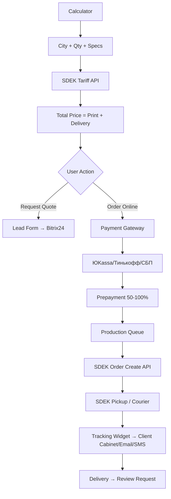

# SDEK Integration & Russia Scaling Strategy — ЦИФРА18

**Date:** 2026-09-11  
**Goal:** Enable Russia-wide delivery via SDEK for all product categories  
**Status:** Design phase — needs dev implementation

---

## 🎯 Strategic Objective

> **Transform ЦИФРА from local Ижевск print shop → Russia-wide print partner with SDEK integration across all touchpoints: calculator, checkout, tracking, schema, content.**

---

## 📦 Current State vs Target

| Component | Current | Target (SDEK-Ready) |
|---|---|---|
| **Delivery** | Self-pickup only (Ижевск) | SDEK to 20,000+ pickup points Russia-wide |
| **Calculator** | Price only | Price + SDEK tariff (real-time) + delivery time |
| **Checkout** | Request form → manager call | Auto-calc delivery → online payment → SDEK widget |
| **Schema** | LocalBusiness only | Product + Offer + shippingDetails (SDEK) |
| **Tracking** | Manager calls client | Auto SDEK tracking widget in cabinet/email/SMS |
| **Content** | Local only | Service×City pages with SDEK delivery info |
| **Payment** | Invoice after production | Online (ЮKassa/Тинькофф/СБП) + prepayment % |

---

## 🔧 Technical Integration Points

### 1. SDEK API Integration

```yaml
# Required SDEK API endpoints:
tariff_calculator:
  endpoint: "https://api.cdek.ru/v2/calculator/tariff"
  input: {from_location: "426069", to_location: "city_code", weight: "kg", dimensions: "cm"}
  output: {tariff_code, price, delivery_time_min, delivery_time_max, currency}

city_autocomplete:
  endpoint: "https://api.cdek.ru/v2/location/cities"
  input: {query: "user_input"}
  output: [{code, name, region, fias_guid}]

tracking:
  endpoint: "https://api.cdek.ru/v2/orders/{uuid}/tracking"
  output: [{date, status, city, description}]

webhooks:
  events: ["ORDER_CREATED", "ORDER_DELIVERED", "ORDER_RETURNED", "STATUS_CHANGED"]
  callback: "https://xn--18-6kc5a3bxam.xn--p1ai/api/sdek/webhook/"
```

### 2. Calculator Integration (Bitrix)

```javascript
// Widget: SDEK Delivery Calculator in Bitrix Catalog
// File: /local/templates/cifra_new/components/bitrix/catalog.element/.default/script.js

async function calculateSDEKDelivery(city, weight, dimensions) {
  const response = await fetch('/api/sdek/tariff', {
    method: 'POST',
    headers: {'Content-Type': 'application/json'},
    body: JSON.stringify({
      to_location: city,
      weight: weight,        // from product properties
      dimensions: dimensions // L×W×H from product properties
    })
  });
  return response.json();
}

// UI: City autocomplete input → shows tariff options (Standard/Express) + price + days
// Integrate into existing calculator: add "Delivery" step after price calculation
```

### 3. Schema.org Integration (Product + Offer + shippingDetails)

```json
{
  "@context": "https://schema.org",
  "@type": "Product",
  "@id": "https://xn--18-6kc5a3bxam.xn--p1ai/catalog/poligrafiya/vizitki/vizitki-na-krafte/#product",
  "name": "Визитки на крафте",
  "offers": {
    "@type": "Offer",
    "price": "4.50",
    "priceCurrency": "RUB",
    "availability": "https://schema.org/InStock",
    "shippingDetails": {
      "@type": "OfferShippingDetails",
      "shippingRate": {
        "@type": "MonetaryAmount",
        "value": "0",
        "currency": "RUB"
      },
      "shippingDestination": {
        "@type": "DefinedRegion",
        "addressCountry": "RU",
        "addressRegion": "Удмуртская Республика"
      },
      "deliveryTime": {
        "@type": "ShippingDeliveryTime",
        "businessDays": {
          "@type": "OpeningHoursSpecification",
          "dayOfWeek": ["Monday", "Tuesday", "Wednesday", "Thursday", "Friday"],
          "opens": "09:00",
          "closes": "18:00"
        },
        "cutOffTime": "14:00",
        "handlingTime": {
          "@type": "QuantitativeValue",
          "minValue": 1,
          "maxValue": 3,
          "unitCode": "DAY"
        },
        "transitTime": {
          "@type": "QuantitativeValue",
          "minValue": 1,
          "maxValue": 3,
          "unitCode": "DAY"
        }
      },
      "doesNotShip": false
    }
  }
}
```

---

## 📍 Service×City Programmatic Pages (SEO + SDEK)

### Target Matrix (Phase 1: 200 pages)

| Service (Top 10) | Cities (Top 20) | Pages | Template |
|---|---|---|---|
| Визитки | Москва, СПб, Екатеринбург, Новосибирск, Казань, Нижний Новгород, Челябинск, Омск, Самара, Ростов, Уфа, Красноярск, Воронеж, Пермь, Волгоград, Ижевск, Воткинск, Глазов, Сарапул, Можега | 200 | ServiceCity template |
| Листовки/флаеры | Same 20 | 200 | ServiceCity template |
| Баннеры/широкоформат | Same 20 | 200 | ServiceCity template |
| Роллапы/стеклы | Same 20 | 200 | ServiceCity template |
| Мерч (кружки/футболки) | Same 20 | 200 | ServiceCity template |

**Total Phase 1:** 1,000 pages (expandable to 5,000+)

### Page Template Structure (ServiceCity)

```markdown
# {Service} в {City} — цены, сроки, доставка СДЭК | Цифра18

## H1: {Service} в {City} — калькулятор цены, сроки от 1 часа, доставка СДЭК

## Intro (Answer-First)
Закажите {service} в {city} с доставкой СДЭК за 1-3 дня. 
Собственное производство в Ижевске — качество, скорость, цена. 
Рассчитайте стоимость онлайн за 30 секунд.

## Calculator Embed (Bitrix widget + SDEK tariff)
[Embedded Calculator Widget]

## Local Content (Unique per city)
- Адрес СДЭК ПВЗ в {city} (топ-3)
- Сроки доставки СДЭК: {min}-{max} дней
- Бесплатная доставка от {amount} руб
- Самоизвоз: Ижевск, ул. 7-я Подлесная, 34

## Comparison Table (if applicable)
| Параметр | Цифровая | Офсетная |
|---|---|---|
| Тираж | 1-500 | 500+ |
| Срок | 1 час | 1-2 дня |

## FAQ (3-5 questions)
Q: Сколько стоит доставка в {city}?
A: Рассчитывается автоматически в калькуляторе. Пример: визитки 100 шт — от 150 руб, 1-2 дня.

## Schema: Service + LocalBusiness + FAQPage + shippingDetails
```

---

## 💳 Payment + Order Flow (Russia-Ready)



### Payment Integration
| Gateway | Methods | Commission | Settlement |
|---|---|---|---|
| **ЮKassa** | Карты, СБП, Яндекс Пэй, Apple Pay, Google Pay | 1.5-2.5% | T+1 |
| **Тинькофф Касса** | Карты, СБП, Тинькофф Пэй | 1.5-2.5% | T+1 |
| **СБП (напрямую)** | Банковские приложения | 0.4-0.7% | Instant |

---

## 📊 SDEK Tariff Logic for Print Products

| Product Category | Weight Calculation | Packaging | SDEK Tariff Code |
|---|---|---|---|
| **Визитки/Листовки/Кальендари** | `qty × weight_per_unit` (from props) | Коробка/пакет | 136 (Посылка склад-склад) / 233 (Дверь-дверь) |
| **Баннеры/пленки (в рулонах)** | `length × width × density` | Тубус/коробка | 233 (Дверь-дверь) |
| **Роллапы/стеклы** | `weight_per_unit` (1.5-5 кг) | Коробка/чехол | 233 |
| **Мерч (кружки/футболки/рюкзаки)** | `qty × weight_per_unit` | Коробка | 136/233 |
| **Кружки/термосы** | `qty × 0.35 кг` | Пупырчатая + коробка | 136 |
| **Настенные панели/оргстекло** | `area × thickness × density` | Деревянная коробка | 233 |

**Default fallback:** If weight unknown → assume 0.5 кг per item, show "Точная стоимость уточняется при заказе"

---

## 📝 Content Requirements for SDEK Pages

### Each Service×City Page Must Have:
- [ ] H1 with service + city + "доставка СДЭК"
- [ ] Calculator embed with SDEK tariff
- [ ] City-specific: top 3 СДЭК ПВЗ, delivery days, free threshold
- [ ] FAQ: "Сколько стоит доставка в {city}?", "Как отследить заказ?", "Можно ли забрать в ПВЗ?"
- [ ] Schema: Service + LocalBusiness + FAQPage + shippingDetails
- [ ] Internal links: calculator, main service page, other cities
- [ ] CTA: "Рассчитать с доставкой" → calculator

---

## 🚀 Implementation Roadmap

### Phase 1 (Month 1-2): Core Integration
| Task | Owner | Effort |
|---|---|---|
| SDEK API credentials + sandbox | Dev | 1 day |
| Tariff calculator API endpoint | Dev | 3 days |
| City autocomplete widget | Dev | 2 days |
| Calculator integration (Bitrix) | Dev | 5 days |
| Schema shippingDetails on all PDPs | Dev | 3 days |
| SDEK webhook handler | Dev | 2 days |
| Testing (sandbox → production) | QA | 3 days |

### Phase 2 (Month 2-3): Programmatic Pages
| Task | Owner | Effort |
|---|---|---|
| ServiceCity template (WP) | Dev + Content | 5 days |
| Generate 200 pages (10 services × 20 cities) | Content + Script | 10 days |
| Schema validation (all pages) | Dev | 2 days |
| Internal linking (calculator, main service) | Dev | 2 days |
| GSC submission + IndexNow | SEO | 1 day |

### Phase 3 (Month 3-4): Conversion + Tracking
| Task | Owner | Effort |
|---|---|---|
| Payment gateway (ЮKassa/Тинькофф) | Dev | 5 days |
| SDEK tracking widget (cabinet/email) | Dev | 3 days |
| Email/SMS automation (status updates) | Marketing | 3 days |
| A/B test: calculator with/without delivery | CRO | 2 weeks |
| Corporate account: SDEK contract + API | BizDev | 2 weeks |

---

## 💰 SDEK Cost Model (for Pricing)

| Route | Weight | Tariff (RUB) | Days | Our Markup |
|---|---|---|---|---|
| Ижевск → Москва | 0.5 кг | 180-250 | 1-2 | +20% |
| Ижевск → СПб | 0.5 кг | 200-280 | 2-3 | +20% |
| Ижевск → Новосибирск | 0.5 кг | 300-400 | 3-4 | +20% |
| Ижевск → Владивосток | 0.5 кг | 500-700 | 5-7 | +15% |
| Ижевск → Ижевск (self-pickup) | - | 0 | 0 | Free >5000₽ |

**Free Delivery Thresholds:**
- Ижевск: >5000 руб
- Удмуртия: >10000 руб
- Россия: >25000 руб (or promo)

---

## 📈 KPIs for SDEK Channel

| Metric | Baseline | M3 | M6 | M12 |
|---|---|---|---|---|
| **Russia orders (% of total)** | 0% | 10% | 25% | 40% |
| **SDEK calculator usage** | 0 | 500/mo | 2000/mo | 5000/mo |
| **Online payment %** | 0% | 20% | 50% | 70% |
| **Avg delivery time (days)** | N/A | 2.5 | 2.0 | 1.5 |
| **Delivery-related support tickets** | N/A | <5% | <3% | <2% |
| **SDEK-related organic traffic** | 0 | 500/mo | 3000/mo | 10000/mo |

---

## ⚠️ Risks & Mitigations

| Risk | Probability | Impact | Mitigation |
|---|---|---|---|
| **SDEK API rate limits** | Medium | High | Cache tariffs 1hr, fallback to static table |
| **Weight calculation errors** | High | High | Validate weight per product in Bitrix props |
| **SDEK pickup failures** | Low | Medium | Fallback: courier pickup from our address |
| **Payment disputes** | Low | Medium | Clear terms, prepayment policy, photo proof |
| **Schema errors on 1000+ pages** | Medium | High | Automated validation script + Rich Results Test sampling |
| **SDEK tariff changes** | Low | Medium | Monthly sync via API, alert on >10% change |

---

## 📁 Related Files

| File | Purpose |
|---|---|
| `scripts/dev-fixes/bitrix_phase0_fixes.md` | Schema templates with shippingDetails |
| `brain/wiki/skills/wp_subdomain_strategy.md` | WP ServiceCity templates |
| `brain/wiki/research/marketing_strategy.md` | SDEK in marketing mix |
| `brain/wiki/research/content_strategy.md` | Service×City content plan |

---

*This document is the technical specification for SDEK integration. Hand to dev team for implementation.*